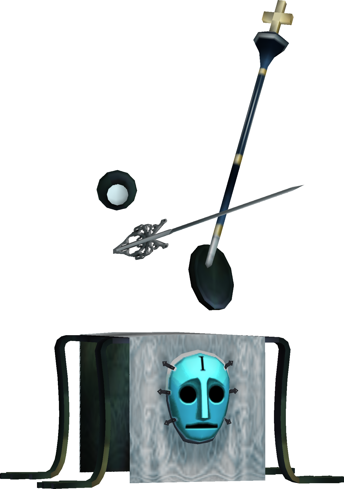
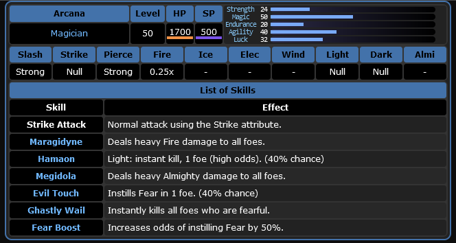
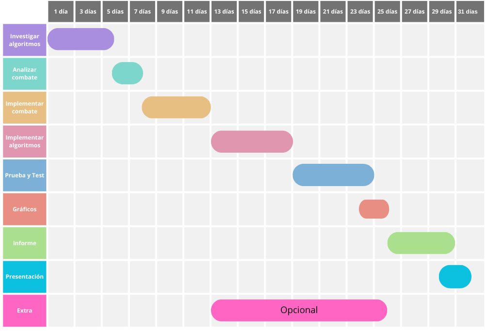

# Comparación de algoritmos para combatir un jefe del videojuego, basado en turnos, Persona 3

## Código: TBCST (Turn Based Combat Sleeping Table)

## Integrantes: Martínez Paula (13866) Y Enzo Palau (13686)

## Introducción:

Persona 3 es un videojuego de rol lanzado en 2006 para la consola PlayStation 2. En este juego, el jugador controla a un grupo de estudiantes que se enfrentan contra criaturas conocidas como sombras en combates por turnos. En estos combates, el jugador debe elegir las acciones de sus personajes, como atacar, usar habilidades especiales, defenderse, usar items diversos, etc. Además, el jugador debe tener en cuenta las debilidades y resistencias de los enemigos, ya que algunos enemigos son débiles a ciertos tipos de ataques y resistentes a otros.

## Descripción:

### Descripción del combate en el videojuego

Los combates en la saga "Persona" son por turnos, es decir, el jugador y los enemigos se turnan para realizar determinadas acciones. Las acciones, tanto del enemigo como las propias, muchas veces se ven afectadas por distintas probabilidades, por ejemplo, el enemigo puede esquivar el ataque con una *probabilidad p*.

En el caso de Persona 3, el jugador controla a un solo personaje y los demás son controlados por el propio juego, aunque uno puede darle directrices generales, llamadas tácticas, de cómo encarar el combate. Este es un grupo de 4 personajes, cada uno con habilidades y características únicas, esto mediante el uso de "personas", seres invocados por el personaje que poseen habilidades especiales y estadísticas, además de debilidades o resistencias a ciertos tipos de ataques (Por ejemplo, un persona puede ser débil al elemento fuego y resistir el elemento hielo). 

En el combate, el jugador debe elegir las acciones de sus personajes, las cuales son: atacar, habilidades (dependiendo el "persona" equipado), usar items y seleccionar tácticas. 

En este juego, hay 9 tipos de ataques: Fuego, Hielo, Electricidad, Viento, Luz, Oscuridad, Físico Perforante, Físico Golpe y Físico Cortante. Cada uno de estos ataques tiene una probabilidad de causar un estado alterado en el enemigo (por ejemplo, congelar, quemar, aturdir, etc). Además, cada ataque tiene un multiplicador de daño dependiendo de la debilidad o resistencia del enemigo. Por ejemplo, si un enemigo es débil al fuego, un ataque de fuego le hará más daño que uno normal.

El enemigo que se eligió para realizar el proyecto es **Sleeping Table**, un enemigo que aparece en el piso 135 de la torre de Tartarus, la cual es una mazmorra que el jugador debe explorar. Este es un enemigo que tiene una alta resistencia a la mayoría de los ataques y no tiene debilidades, por lo que es considerado un *jefe* muy difícil.

### Objetivos

El objetivo de este proyecto es tratar de encontrar una solución para el combate contra Sleeping Table, el cual es un enemigo de Persona 3. Esto se logrará mediante tres algoritmos: como base, un algoritmo random, luego un algoritmo genético y si se tiene suficiente tiempo, reinforcement learning, luego, se realizará una comparativa utilizando distintas métricas para evaluar qué algoritmo tuvo mejores resultados y es conveniente aplicar en este problema. 

### Descripción del problema y modelado del entorno

Para implementar los algoritmos, se debe modelar el combate, luego de un estudio de la pelea, en Python. Se codificará toda la pelea en este lenguaje con la salida en la terminal (si da el tiempo, se hará algo mínimamente visual utilizando Pygame).

En este programa, se debe simular el combate contra Sleeping Table, teniendo en cuenta las mecánicas del combate y las características del enemigo. Se debe tener en cuenta las probabilidades de que el enemigo use ciertas habilidades, la probabilidad de que esquive un ataque, la probabilidad de que cause un estado alterado, etcétera.

Los algoritmos retornarán una secuencia de acciones que el personaje debe realizar en el combate. 
Luego, se realizarán pruebas con diferentes configuraciones de los algoritmos y se compararán los resultados obtenidos con diferentes métricas para corroborar el correcto funcionamiento de los mismos.

### Métricas a utilizar

Las métricas a utilizar serán: 
- En cuanto al combate en sí, para medir qué tan cerca estamos de la solución se medirá: cantidad de turnos necesarios para derrotar al enemigo, cantidad de daño recibido y cantidad de daño realizado.
- En cuanto a la comparación de los algoritmos, también se tendrá en cuenta la cantidad de iteraciones, tiempo de entrenamiento y si llega al objetivo o qué tan cerca quedó de él.

Para establecer una comparación, se crearán 100 semillas o escenarios diferentes que no estén en el momento de entrenamiento, y se probarán los algoritmos con cada una de ellas. Luego, se compararán los resultados obtenidos con porcentaje de escenarios resueltos y diversas métricas, como: media y desviación estándar de daño realizado y recibido, turnos y las demás métricas mencionadas anteriormente.

Se realizarán tablas y gráficos comparativos para un posterior análisis de los resultados.
Por último, se evaluará una reflexión sobre cúal algoritmo tiene un costo (computacional) - beneficio que mejor se adecúe a las necesidades del problema

### Algoritmos a utilizar

Para establecer un punto de partida y tener una métrica de base, se utilizará un algoritmo que ejecute acciones de **manera aleatoria**. Luego, se implementarán dos algoritmos de IA: **algoritmo genético** y **reinforcement learning** (si es que da el tiempo).

El algoritmo genético se utilizará para encontrar la mejor secuencia de acciones que el personaje debe realizar en el combate. Se utilizará una población de individuos que representan secuencias de acciones posibles (lista de acciones, siendo las acciones los genes), y se evaluará la aptitud de cada individuo en base a algunas de las métricas mencionadas anteriormente. Luego, se seleccionarán los mejores individuos y se cruzarán y mutarán para generar una nueva población. Este proceso se repetirá hasta que se alcance un criterio de parada.

## Justificación:

Se considera que se puede aplicar algoritmos/técnicas de IA y no solucionar mediante algún otro enfoque ya que investigando en proyectos de aplicación de IA en videojuegos, se encontró que los algoritmos genéticos y de refuerzo son muy utilizados en videojuegos para modelar lo que puede ser una de las posibles soluciones para desafíos en estos. Por otro lado, se considera que el combate en Persona 3 es un buen caso de estudio para comparar estos algoritmos, ya que el combate en este juego está basado en turnos y tiene mecánicas que pueden ser modeladas de manera sencilla.

## Listado de actividades a realizar:

1. Investigar los algoritmos genéticos y de refuerzo y su aplicación en videojuegos. [4 días]

2. Analizar el combate elegido y sus mecánicas. [2 días]

    (a) Investigar las mecánicas del combate en Persona 3. 
    (b) Recopilar información sobre el jefe a combatir. (Stats, habilidades, debilidades, cómo se comporta, probabilidad de que use ciertas habilidades, cambio de comportamiento, tiene sesgos, daño que hace, etc)
    (c) Recopilar información acerca de las habilidades posibles de nuestros personajes (con los mismos criterios anteriormente mencionados).

3. Implementar el combate en un programa de prueba a partir de la información recopilada. [5 días]

4. Implementar algoritmo de base y genético asegurandose de que funcionen en la implementación del combate [6 días]

5. Realizar pruebas y comparar resultados [6 días]

    (a) Realizar pruebas con diferentes configuraciones de los algoritmos. 
    (b) Comparar los resultados obtenidos.
    (c) Realizar mejoras y ajustes en los algoritmos.

6. Realizar tablas y gráficos comparativos para un posterior análisis de los resultados [2 día]

7. Realizar el informe [5 días]

8. Realizar la presentación [2 días]

#### Tiempo extra: 

- Implementar algoritmo de refuerzo asegurandose de que funcionen en la implementación del combate, haciendo sus respectivas gráficas y comparaciones.

## Cronograma

## Referencias

- https://megamitensei.fandom.com/wiki/Sleeping_Table
- https://megamitensei.fandom.com/wiki/Persona_3
- Artificial Intelligence A Modern Approach - Third Edition