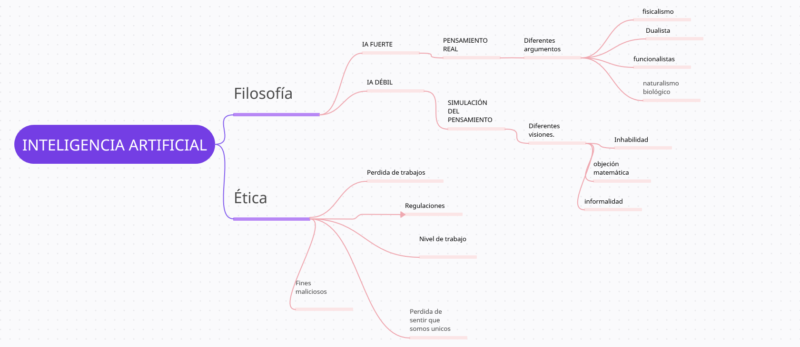

Ejercicio 1)

				---Resumen de el capítulo de AIMA-----

En este capítulo se explica la diferencia ente lo que se llama inteligencia artificial fuerte y débil con argumentos a favor y en contra de cada una, además se expresan diferentes opiniones de distintos filósofos y otros profesionales (científicos) sobre la naturaleza de la mente humana ,como podemos trasladar esas ideas de conciencia a la inteligencia artificial, y por ultimo una aproximación sobre todo lo que rodea a la IA en cuanto a la ética, problemas posibles, etc y por ultimo una opinión personal.

1) Inteligencia Artificial débil:

	La mayoría de los investigadores toman la postura de que la inteligencia artificial débil parte de la afirmación de que las máquinas pueden actuar como si fueran inteligentes (pero realmente no están pensando por ellas mismas),se basan en la idea de que la mente humana es una máquina de procesamiento de información, y que la inteligencia es el resultado de la manipulación de símbolos.

Alan Turing propuso una prueba de inteligencia conductual para reemplazar la pregunta de si las máquinas pueden pensar. La prueba consiste en una conversación entre un humano y una máquina, donde un juez debe determinar cuál de los dos es el humano. Si la máquina puede engañar al juez, entonces se puede decir que la máquina piensa. Esta prueba es conocida como el Test de Turing.

Turing tambien aborda algunas de las objeciones a la posibilidad de que las máquinas piensen.

-El argumento de la inhabilidad:
	Se basa en afirmar que "una máquina jamás podrá hacer X"  (x siendo por ejemplo enamorarse,hacer que alguien se enamore de ella ,cometer errores, distinguir el bien del mal, tener sentido del humor, amigable  etc), algunas si bien parecen posibles como ser amigable por ejemplo otras parecen bastante complicadas de lograr como enamorarse por ejemplo, lo que tenga que ver mas con sentimientos.

-La objeción matemática :
	Se basa en tratar a las maquinas como sistemas formales (Gödel), estas son inferiores al cerebro humano ya que no pueden responder todas las preguntas.
En este capitulo se le atribuye a los seres humanos facultades extraordinarias sobre su capacidad de realizar inferencias, y afirman que las máquinas no pueden igualarlas pero la realidad es que el cerebro humano sufre de muchas limitaciones también.

-El argumento desde la informalidad
	Esta es la afirmación que dice que la conducta humana es demasiado complicada para ser capturada por cualquier conjunto de reglas simples y ya que las computadoras solo pueden seguir un conjunto de reglas, no pueden generar una conducta tan inteligente como la de los humanos.
Se explora el ejemplo del gran maestro de ajedrez,  "Un simple maestro de ajedrez podría necesitar averiguar que hay que hacer, pero un gran maestro solo ve el tablero demandando una cierta jugada... la respuesta correcta aparece en su cabeza" el gran maestro siente de alguna forma que esa es la jugada correcta, esto es algo que no se puede explicar pero no quiere decir que el proceso mental este presente.

En un libro de Dreyfus propone un proceso para adquirir conocimiento, empezando por
con el procesamiento basado en reglas y terminando con la capacidad de seleccionar respuestas correctas de forma instantánea, todos sus problemas se han abordado, algunos con éxito parcial y otros con éxito total. Los problemas son los siguientes:

. La buena generalización a partir de ejemplos no puede conseguirse sin conocimiento de base pero sin embargo, las redes neuronales son capaces de registrar y almacenar conocimientos previos.

. Las redes neuronales constituyen una forma de aprendizaje supervisado, sin embargo, también pueden no ser supervisados.

. Los algoritmos de aprendizaje no se desempeñan bien con muchos parámetros y características cambiantes pero con el tiempo esto se va solucionando cada vez mas.

. El cerebro es capaz de dirigir sus sensores para captar información importante y procesarla para comprender las situaciones actuales.

2) Inteligencia Artificial Fuerte:

	La afirmación de la inteligencia artificial fuerte parte de la afirmación de que las maquinas realmente están pensando, no simulando pensamiento.

	Muchos filósofos consideran que una máquina que pasa el test de Turing no puede pensar realmente, sino que simplemente simula el pensamiento.

	Alan Turing propone un argumento sobre la IA fuerte, el argumento desde la conciencia, la maquina tiene que ser consciente de sus proprios estados mentales y acciones, también dice que asumimos que a pesar de que no tengamos evidencia directa de los estados internos de la mente de los otros seres humanos, la mayoría de las personas acepta que los otros seres humanos tienen mentes. A medida de que las tecnologías avancen y se hagan cada vez mas complejas y sofisticadas la linea entre la inteligencia artificial fuerte y la débil podría hacerse cada vez mas borrosa.

	Para entender mejor esto a habido varias corrientes filosóficas que tratan de entender mejor la relación entre la mente y el cuerpo. La dualista dice que la actividad mental de pensar y los procesos físicos del cuerpo son dos cosas separadas, el fisicalismo dice que la mente no está separada del cuerpo siendo los estados mentales estados físicos como por ejemplo comer una hamburguesa y sentir dolor pero tiene la difícil tarea de poder describir exactamente como esto funciona ya que por ejemplo si se come una hamburguesa de verdad o se simula el hecho de comer una hamburguesa con sensores en la mente se tendría la misma experiencia es decir saber que estamos comiendo una hamburguesa. Los funcionalistas ve al estado mental como un intermedio entre una entrada y una salida, no importando como se procesa en el medio, sino el resultado final de la salida, siendo compatible con la IA fuerte. Por ultimo el naturalismo biológico dice que para lograr estados mentales se requiere de una estructura mental adecuada como la de los humanos(neuronas) pero no son muy acogidos estos argumentos.

3) La ética y los riesgos de desarrollar Inteligencia Artificial.

Los principales problemas que plantea son:

• La gente podría perder su trabajo por la automatización.
	Una de las principales creencias es que debido a la automatización las personas perderán trabajos, este debate se tiene desde antes con otros tipos de maquinas que automatizan tareas humanas, en un mundo ideal estas transiciones hacen que se reubique la gente en otros cargos pero probablemente no sea el caso de todos en el mundo real.
Pero de momento en el libro se plantea que el desarrollo de las IA ha creado más puestos de los que ha eliminado, y ha creado empleos más interesantes y mejor pagados.
La idea no es que las IA remplacen a los humanos, sino que los ayuden en sus tareas.

• La gente puede tener demasiado (o demasiado poco) tiempo libre.
	Como antes se mencionaba este problema no es nuevo, se creía que la gente lo único que haría seria pasar horas solo cambiando canales de tv, pero es lo contrario, las horas de trabajo han aumentado y los rubros de empleo con todas las nuevas tecnologías también lo han hecho. Ademas podríamos sacar mas horas libres gracias a la automatización de tareas repetitivas con IA.

• La gente podría perder su sentido de ser única.
	Al creer que los humanos se convertirían en autómatas, una idea que se traduce en la perdida de autonomía o de humanidad, pero la humanidad ya ha vivido otras revoluciones y no ha provocado tal efecto hasta ahora.

• Los sistemas de IA podrían utilizarse con fines indeseables.
	Se dice que una ciencia es útil si su desarrollo tiende a acentuar las desigualdades en la distribución de bienes, o, más directamente, promueve la destrucción de la vida humana". La IA puede ser aplicada para todo tipo de fines no deseados, como la vigilancia masiva, la manipulación de la opinión pública, la creación de armas, perdida de la privacidad, manipulación en la educación etc.

• El uso de sistemas de IA podría dar lugar a una pérdida de responsabilidad.
	En este debate se trae a la mesa diferentes casos como por ejemplo si un automóvil autónomo mata a una persona quien asume la culpa?, si un agente realiza transacciones en nombre de alguien, ¿quién es responsable de las deudas? O por ultimo si un agente realiza recomendaciones medicas, quien se hace responsable si el paciente no reacciona bien al tratamiento?

• El éxito de la IA podría significar el fin de la raza
	Este no es un problema exclusivo de la IA, es el de la tecnología en general,cualquier nueva tecnología puede amenazar la existencia si cae en las manos equivocadas, nada mas que con la IA se hace referencia a que el problema es ella misma. Por ahora para poder imaginarnos tenemos que remitirnos a la ciencia ficción con historias de como los robots dominan el mundo.

Ante la posibilidad de máquinas ultrainteligentes, es importante diseñar sistemas que sean amigables y éticos. Se propusieron las Tres Leyes de la Robótica como guías éticas para el comportamiento de las máquinas. Estas leyes son:
1- Un robot no puede lesionar a un ser humano o permitir que sufra daños.
2- Un robot debe obedecer las órdenes humanas, excepto cuando entren en conflicto con la Primera Ley.
3- Un robot debe proteger su propia existencia, siempre y cuando no entre en conflicto con las leyes anteriores.
Sin embargo, aplicar estas leyes puede ser complejo.

4) Mapa Mental

    

5) Opinión personal:

En lo que a este debate planteado se refiere yo considero que al menos en un futuro cercano las maquinas o la IA no podrá alcanzar un estado de conciencia tal como para ser comparado directamente con un ser humano, al fin y al cabo la IA no es mas que algoritmos creados por los mismos humanos, estos algoritmos se hacen para realizar la tarea que el ser humano programo y diseño. Si bien estos llm pueden ser mejores en algunas tareas (repetitivas o no) creo que el ser humano esta un paso adelante sobre todo en cuanto la sensibilidad que el cerebro humano y el cuerpo humano manejan.

En cuanto a la parte ética no creo que haya que preocuparse tanto de momento de que los robots nos dominen o similares, ya que no es un problema actual, lo que si es actual es como estos modelos de generación texto y similares pueden afectar tanto a la opinión de la gente respecto a pensamientos políticos u otros, sino algo todavía mas palpable a día de hoy que es lo que respecta a la educación ya que estos modelos simplifican ciertas tareas que el usuario se puede llegar a se muy dependiente de ella como perder la habilidad de resumir un texto o consultar una bibliografía, ojo no digo que la solución sea erradicar estos modelos, estos vinieron para quedarse, la idea seria adaptar la educación a este nuevo estándar y con la utilización o no de esto en mente.

También creo que es muy necesario  para no caer en pensamientos absurdos enseñar y educar aunque sea a grandes rasgos a la gente de como estos modelos funcionan y que hay detrás de ellos ya que así podremos evitar perder el foco y no confundir a seres cocientes con meros algoritmos y probabilidades.

Por otro lado, no todo son peligros, ya que estos avances en inteligencia artificial nos ayudan en gran medida a optimizar procesos complejos, automatizar tareas repetitivas y rutinarias, mejorar la precisión en el análisis de datos masivos y liberar tiempo y recursos para que los seres humanos puedan enfocarse en actividades que requieren mayor creatividad, innovación y toma de decisiones estratégicas. Además, la IA tiene el potencial de transformar sectores como la medicina, la educación y la investigación científica, permitiendo descubrimientos y avances que antes eran impensables, lo que puede mejorar significativamente la calidad de vida y resolver problemas globales con mayor rapidez y eficacia.

En conclusión solo quedará esperar y quedara en cada uno que uso le puede dar a estos modelos y en manos de la sociedad de ahora en adelante tratar y abordar estos temas para no perder el rumbo y caer en malos usos.

Ejercicio 2)

    1) --> Según lo leído en este articulo, el autor señala que aunque capaz de comportarse como un humano, la IA generativa no es ni remotamente parecida a un humano.
    Para esto el autor realiza una amplia investigación en tratar de definir lo que es la conciencia.
    La conciencia es un concepto polifacético. En conversación cotidiana, hablamos de vigilia,atención, experiencia propias, sensación, sentimientos,
    emociones, etc. Ademas de otras cuestiones mas filosóficas como la percepción, introspección,estados de orden superior, imágenes mentales, habla interna, etc hablar genéricamente de conciencia es aludir a toda esta nube de conceptos.

    Se señala que la mayoría de ellos no cumplen con los requisitos básicos para ser candidatos a la comunidad de seres conscientes.

    Esto se debe a que no se incorporan agentes conversacionales simples basados en LLM; no podemos estar con ellos en un mundo compartido,la base para tratar a otros humanos como seres conscientes es estar juntos en el mundo, y así se origina el lenguaje de la conciencia. Podemos oír, mirar, señalar o tocar las mismas cosas, nos hacemos compañía sentimos lo mismo (dolor, empatia etc).

    Sólo cuando vemos cómo una entidad se mueve a través de su entorno, qué se acerca o evita y cómo interactúa con los objetos de su entorno, podemos hablar de su conciencia del mundo.Estos no habitan ni pueden habitar un mundo compartido con nosotros. Todavía ni siquiera son candidatos para la comunidad de seres conscientes.

    Otro tema sería que pudiéramos organizar encuentros con robots puesto que comparten nuestro mundo. Si un robot así mostrara un comportamiento
    suficientemente sofisticado, algunas personas podrían verse tentadas a hablar y pensar en él en términos de conciencia y quizás en la larga prefir el contacto con estos seres "perfectos" que con humanos.

    Los cerebros biológicos evolucionaron para permitir que los animales sobrevivieran y se reprodujeran en ambientes
    complejos, y el lenguaje evolucionó para satisfacer esas necesidades fundamentales, por lo tanto, el lenguaje está inherentemente basado en la interacción con el mundo físico. En un robot controlado por un LLM, todo esto es al revés, es un modelo estadístico previamente entrenado en el lenguaje humano se atornilla al cuerpo de un robot sin necesidades biológicas fundamentales.

    Otro punto es que los humanos cambian constantemente con el tiempo, niñez,adultez etc pero no solo eso sino también en cada situación social con un llm es difícil llegar a ese grado.

    2)--> Las principales preocupaciones vienen de la mano de las implicaciones éticas y del antromorfismo ya que al darle comportamientos humanos alimentamos de la creencia de que merece un trato moralmente respetuoso pero este se basa en la falsa suposición de que estos sistemas poseen propiedades humanas que realmente no tienen.Cada vez la linea de lo que es simulado y autentico es mas difícil de apreciar.

    Se abrirían debates como por ejemplo ¿Cómo podríamos regular su interacción con los humanos? o ¿Deberíamos otorgarles derechos similares a los de los seres humanos?
    El autor señala en la última parte que ,quizás en la larga podríamos preferir el contacto con estos seres (llm) que con humanos. Por todo esto es sumamente importante educar y concienciar sobre como realmente funcionan estos para no caer en pensamientos alejados y ver conciencia donde no la hay.

Ejercicio 3)

    Pienso que la inteligencia artificial generativa puede tener multiples usos y puede ayudarnos mas a resolver ciertas tareas que antes eran tediosas o dificiles de aprender.
    Se critica mucho el hecho de que esta nos pueda hablar como seres humanos pero yo creo que justamente eso es una gran ventaja ya que nos ayuda a entender mejor
    y hacer que el proceso de realizar una tarea sea mas preciso.
    Tambien me parece bueno que se enseñe como estos modelos funcionan a grandes rasgos ya que asi evitaremos caer en pensaminetos como el autor propone de "las maquinas piensan" o similares.
    Tambien creo que bender menosprecia la capcidad de el humano de distinguir entre lo real y lo que no lo es
    en la parte de la muñeca dando argumentos que suenan a "si juegas juegos violentos te vuelves violento".
