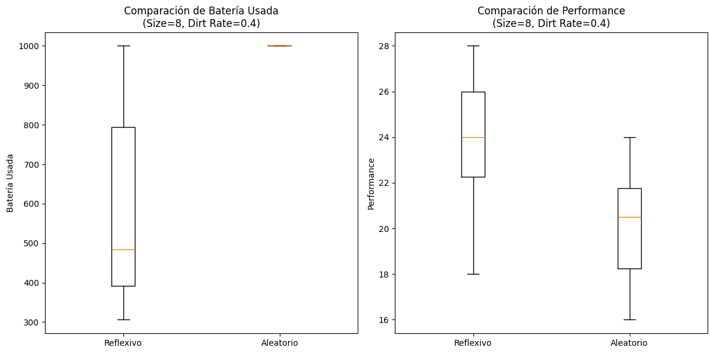

# Agentes racionales    

## Introducción:    

En la presente investigación se aborda el problema de la limpieza autónoma de un entorno dado con dos agentes aspiradora que deberán recorrer el entorno (reflexivo y random), detectar la suciedad, limpiarla, y continuar hasta que su vida útil se agote. El objetivo principal es evaluar el rendimiento de los agentes en diferentes configuraciones de tamaño del entorno y niveles de suciedad, luego compararemos los resultados de estos dos y veremos si alcanzan un resultado óptimo.   

## Marco teorico:

Comenzaremos con la definición de agente:

Un agente es aquel que, a través de sensores, percibe su entorno en un momento determinado y actúa sobre él a través de actuadores. En este caso, la implementación del entorno corresponde a la clase Environment y la del agente a la clase Agent.

En el presente trabajo abordamos dos tipos de agentes:

    Reflexivo simple: Estos agentes tienen la capacidad de tomar decisiones en base únicamente a la información que disponen en ese momento determinado (casilla actual en este caso).

    Agente Random: En este caso, este agente tendrá acciones aleatorias en cada iteración.

Concepto de racionalidad para el contexto del problema:

En el presente trabajo usaremos a menudo el concepto de racionalidad:

Un agente es racional si, para el objetivo del problema concreto, este puede actuar de manera que maximice la performance, de manera tal que alcance al final un resultado lo suficientemente óptimo.

## Diseño experimental:

En la simulación, el entorno está representado por una matriz, donde cada celda puede estar sucia o limpia (esto lo determinará el nivel de suciedad dado). Los agentes, que se mueven por este entorno, están equipados con sensores que les permiten detectar si la celda en la que se encuentran está sucia, y con actuadores que les permiten moverse en dirección abajo, arriba, derecha e izquierda y limpiar la suciedad.

El agente toma decisiones en cada paso del tiempo, eligiendo entre limpiar la celda actual o moverse a otra celda. El rendimiento (performance) del agente se mide en función de la cantidad de suciedad eliminada antes de que su vida útil se agote.

La batería del agente se reduce en cada acción que realiza, ya sea moverse o limpiar. De esta manera, podemos observar en un periodo de 1000 unidades cuál agente realiza mejor el trabajo de maximizar la performance.

Para evaluar el rendimiento de los agentes, se decidió variar tanto el tamaño del entorno como el porcentaje de suciedad inicial. Los tamaños del entorno incluyen matrices de 2x2, 4x4, 8x8, 16x16, 32x32, 64x64, y 128x128 celdas. Los porcentajes de suciedad se establecieron en 10%, 20%, 40% y 80%, para simular diferentes niveles de dificultad.

Cada combinación de tamaño y porcentaje de suciedad fue repetida 10 veces y el rendimiento se midió en términos del número de celdas limpias al agotarse la batería del agente.

## Análisis y discusión de resultados:

Para comenzar con la discusión de los resultados, vamos a comparar ambos agentes en el mismo entorno. De esta manera, podemos establecer una comparación justa entre ambos. Luego, también a modo de ver otra variante, veremos cómo se comportan en entornos distintos. Esto, si bien podría parecer una comparación no tan justa, resulta curioso ver cómo los resultados aún así mantienen la misma tendencia.

1) Mismo entorno:

Comenzaremos por describir el primer gráfico del tipo caja y extensiones. Para ello, se ven dos parámetros: por un lado, tenemos la comparación de ambos respecto a la batería o vida usada y, por otro, la performance. Estos se hicieron para 10 corridas al programa con una configuración de size 8 y dirt rate de 0.4

En cuanto a la batería, podemos observar claramente cómo el agente random, para la configuración actual, siempre usa toda la batería, la cual son 1000 unidades. Sin embargo, el agente reflexivo no lo hace; de hecho, la mediana se encuentra cercana a los 470 aproximadamente.

En cuanto a la performance para la configuración actual, vemos cómo el reflexivo saca más puntos en general, con una mediana de aproximadamente 24, mientras que el random tiene una mediana de aproximadamente 21 puntos.

Pasaremos a describir el segundo gráfico, el cual se trata de uno del tipo barras, en el cual se muestran en el eje X todos los posibles tamaños de mapa y en el eje Y la medida de performance para las 10 corridas del programa con un dirt rate de 0.4.

También en este caso, podemos observar cómo el agente reflexivo, a medida que los mapas se agrandan, obtiene muchos más puntos de performance.

Por último, pasaremos a ver otra comparación que, si bien es menos justa, vemos cómo la conclusión no cambia. En estos gráficos se describe en el eje X los distintos tamaños con sus dirt rates y en el eje Y el puntaje de la performance o batería para entornos totalmente distintos para ambos.

Como se mencionó antes, podemos observar que si vemos la batería, por ejemplo, el agente random usa toda la batería mucho antes.

Con todos estos análisis, podemos asegurar que el agente reflexivo simple tiene mejor rendimiento en todos los aspectos respecto de uno totalmente aleatorio.

## Conclusiones:

En conclusión, se puede observar cómo tanto el agente reflexivo simple como el agente random pueden llegar a ser útiles en un entorno pequeño de limpieza; solo ahí podríamos hablar de un poco de racionalidad. Pero, como observamos, a medida que este entorno se hace cada vez más grande, si bien el primero (reflexivo) lo maneja un poco mejor, vemos que gastan toda su vida útil y no logran limpiar el entorno completo. Por lo tanto, al no llegar a un resultado lo suficientemente óptimo o aceptable, no podemos asegurar que estos sean racionales en su entorno.

Por otro lado, sería interesante pensar en lo que podría lograr un agente con alguna información extra de entrada o que se guarde a medida que limpie el entorno, como lo podría ser, por ejemplo, saber qué camino tomar de menor resistencia al conocer la ubicación de la basura o la geografía del entorno, u otras ideas que podrían acercarse a que se alcance un resultado más óptimo, maximizando la performance.
