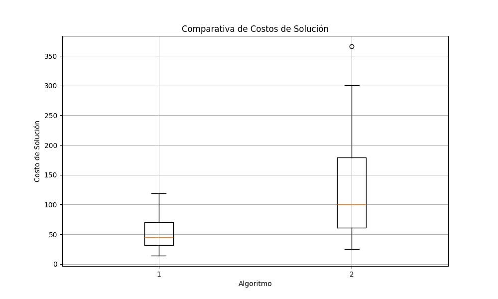

# Reporte de los resultados de el tp3 y tp4 busquedas no informadas e informadas en FrozenLake

## Introducción:

En el presente trabajo se aborda el problema de las busquedas informadas y no informadas, para ello se utilizará el entorno de FrozenLake el cual es parte de la biblioteca gymnasium,
en el cual se muestra un entorno congelado donde parte de las presentes cuadriculas pueden ser hoyos en el hielo provocando que si el agente cae en dicho hoyo este no pueda llegar al objetivo,
para poder realizar estos caminos desde el inicio al objetivo se utilizan distintos algoritmos, por parte de los algoritmos de busqueda no informada bfs,dfs,dfs limitado,costo uniforme y random y
por parte de las informadas tenemos el algoritmo A*,a modo de experimento tambíen veremos como se comporta un agente aleatorio, luego de que estos nos retornen el camino ejecutaremos los pasos en el entorno.

## Marco teórico:

La busqueda informada se refiere a la busqueda de un camino desde un nodo inicial a un nodo objetivo, en la cual se tiene información sobre la distancia de los nodos al objetivo, por lo cual se puede estimar el costo de llegar al objetivo,
por otro lado la busqueda no informada se refiere a la busqueda de un camino desde un nodo inicial a un nodo objetivo, en la cual no se tiene información sobre la distancia de los nodos al objetivo, por lo cual se debe recorrer más estados para encontrar el camino mas corto.

En el presente trabajo se utilizarán los siguientes algoritmos de busqueda no informada y informada:

No informada:

Bfs: Este algoritmo de busqueda no informada se basa en recorrer el grafo en anchura para encontrar el camino mas corto desde el inicio al objetivo.

Dfs: Este algoritmo de busqueda no informada se basa en recorrer el grafo en profundidad por lo cual no garantiza encontrar el camino mas corto desde el inicio al objetivo.

Dfs limitado: Este algoritmo de busqueda no informada se basa en recorrer el grafo en profundidad pero con un limite de profundidad por lo cual no garantiza encontrar el camino mas corto desde el inicio al objetivo.

UCS: Este algoritmo de busqueda no informada se basa en recorrer el grafo en base al costo de las acciones, por lo cual se garantiza encontrar el camino mas corto desde el inicio al objetivo.

Informada:

A*: Este algoritmo de busqueda informada se basa en recorrer el grafo en base a una heuristica que nos permita encontrar el camino mas corto desde el inicio al objetivo.

Se puede definir una heuristica como una función que nos permita estimar el costo de llegar desde un nodo al objetivo, para el caso de este trabajo se utilizara la distancia de manhattan, la cual
se puede definir como el valor absoluto de la resta de las coordenadas de los nodos.

## Diseño experimental

Este trabajo fue realizado en python3, con el fin de comparar los algoritmos de busqueda no informada y los informados en el entorno de FrozenLake,
para ello se plantea un objetivo en el cual se busca encontrar el camino mas corto desde el inicio al objetivo,

Para relizar el objetivo planteamos 30 escenarios diferentes generados de manera aleatoria en el cual setearemos una probabilidad de la casilla sea hielo de 1-0.08, con un tablero de 100 por 100 casillas,
cabe recalcar que el incio y el fin tambien se ubican de manera aleatoria.

Luego de tener los escenarios generados se procederá a ejecutar los algoritmos de busqueda no informada y los informados y random, en dos escenarios diferentes, uno con costo de cada acción igual a 1 y otro con costo de cada acción igual
a uno mas que la acción correspondiente, por ejemplo ir a la izquierda tiene costo 1, ir a la abajo tiene costo 2 etc,para luego comparar los resultados obtenidos.

Por ultimo la cantidad de acciones es seteada a 1000, en el caso de que el algoritmo no llegue al objetivo en los 1000 pasos se considera que no llegó al objetivo.

## Resultados

Para mostrar los resultados obtenidos se graficó los distintos casos de prueba en graficos de cajas y bigotes, en los cuales se muestra la distribución de los resultados obtenidos por cada algoritmo en los distintos escenarios.

. Comenzamos mostrando los resultados obtenidos para las busquedas no informadas; cabe recalcar que solo se graficaron los resultados que si llegaron a el objetivo.

En este grafico podemos se graficó la cantidad de nodos explorados por cada algoritmo en los distintos escenarios, en el cual se puede observar que el algoritmo bfs es el que explora menos nodos en todos los escenarios,
en el caso de dfs y su versión limitada pordemos ver que al explorar tantos nodos estos no llegan a encontrar el objetivo en los 1000 pasos, por otro lado también vemos que el algoritmo de costo uniforme en ambos casos explora
nodos de manera similar.

Se puede observar que salvo dfs, los tiempos de ejecución de los algoritmos son similares, en el caso de dfs se puede observar que el tiempo de ejecución es mayor que los demás algoritmos.

Se compara los costos de ambos escenarios para el algoritmo de costo uniforme, en el cual se puede observar que el costo de las acciones afecta en el costo total del camino.

 

En este caso se observa que para el algoritmo random el tiempo de ejecución es mayor que los demás algoritmos, en el caso de los nodos explorados se puede observar que el algoritmo random nunca alcanza el objetivo en menos de 1000 pasos.

Por ultimo se muestra la media y desviación estandar de los algoritmos en los distintos escenarios. Las conclusiones de esta prueba son mas o menos las mismas
que las obtenidas en los graficos anteriores, bfs y ucs son los algoritmos que menos nodos exploran y menos demoran, dfs y su versión limitada no llegan a encontrar el objetivo en los 1000 pasos y el algoritmo random nunca llega al objetivo.

. Pasaré a mostrar los resultados obtenidos para las busquedas informadas, comparando los resultados obtenidos en los distintos escenarios.

Se puede observar como para el caso de A* con la heuristica elegida, la cantidad de nodos explorados es significativamente menor que para los demás algoritmos en ambos escenarios.

En este caso también observamos como el tiempo de ejecución de A* es menor que el de los demás algoritmos en ambos escenarios.

En cuanto al costo de la solución en ambos escenarios, se puede observar que dado que ambos algoritmos retornan la misma solución, el costo de la solución es el mismo.

Por ultimo se observa la media y desviación estandar de los algoritmos en los distintos escenarios, en el cual se puede observar que A* es el algoritmo que menos nodos explora y menos demora en encontrar el objetivo.

## Conclusiones

Podmos concluir que los algoritmos de busqueda informada son mas eficientes que los algoritmos de busqueda no informada, en el caso de los algoritmos de busqueda no informada,
se puede observar que el algoritmo bfs es el mas eficiente en cuanto a tiempo y nodos explorados, en el caso de los algoritmos de busqueda informada se puede observar que el algoritmo A* es el mas eficiente en cuanto a tiempo y nodos explorados.
En general el algoritmo random es el menos eficiente en cuanto a tiempo y nodos explorados junto con dfs mientras que el algoritmo A* es el mas eficiente en cuanto a tiempo y nodos explorados por lo que es el mas completo de los algoritmos.

En lo personal opino que para este trabajo en particular no hay gran diferencia entre usar ucs,bfs o A* ya que el tablero es muy pequeño, pero en un tablero mucho mas grande o resolver otros problemas mayores A* es el algortimo mas eficiente.
