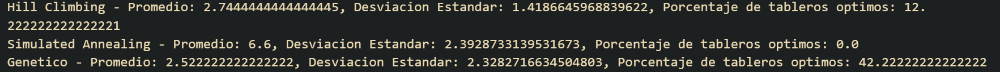
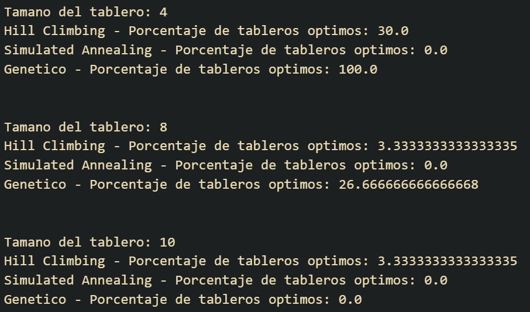

# Busquedas Locales

## Introducción

En el presente trabajo se aborda el problema de las n-reinas utilizando las técnicas de búsqueda local. El problema de las n-reinas consiste en colocar n reinas en un tablero de ajedrez de nxn
de tal forma que ninguna reina pueda atacar a otra. Una reina puede atacar a otra si se encuentran en la misma fila, columna o diagonal.
Para resover este problema se utilizan las técnicas de búsqueda local de hill climbing y simulated annealing asi como tambien un algorithm genético.

## Marco teorico

### Hill Climbing

El algoritmo de Hill Climbing es un algoritmo de optimización local que se utiliza para resolver problemas de optimización. La idea principal de este algoritmo es que, dado un problema y una función objetivo,
el algoritmo intenta encontrar un estado que minimice o maximice la función objetivo. Para hacer esto, el algoritmo comienza en un estado aleatorio y luego se mueve a estados vecinos que tengan un valor de función objetivo mejor que el estado actual.
El algoritmo se detiene cuando no hay estados vecinos que tengan un valor de función objetivo mejor que el estado actual.

### Simulated Annealing

El algoritmo de Simulated Annealing es un algoritmo de optimización global que se utiliza para resolver problemas de optimización. Dado un problema y una función objetivo se busca maximixar o minimizar la función objetivo mientras la temperatura no sea 0.

### Algoritmo Genético

El algoritmo genético consta de una población de individuos que representan posibles soluciones al problema. Cada individuo tiene un conjunto de genes que representan una posible solución al problema.
El algoritmo comienza con una población inicial de individuos y luego evoluciona la población a través de generaciones. En cada generación, los individuos se cruzan y mutan para producir una nueva generación de individuos.
El algoritmo termina cuando se alcanza un criterio de parada, como un número máximo de generaciones o una solución aceptable.

## Diseño experimental

Para realizar el trabajo se utilizo el lenguaje de programación Python, se crearon 30 tableros para cada uno de los valores de n (4, 8, 10) que representan la canidad de reinas en el tablero
y se ejecutaron los algoritmos de Hill Climbing, Simulated Annealing y Algoritmo Genético para cada uno de los tableros.
Los tableros se generaron aleatoriamente y estos son representados como una matriz de nxn donde cada casilla de la matriz representa una casilla del tablero y el valor de la casilla representa si hay una reina en esa casilla o no.
Tambien se realizo un análisis de los resultados obtenidos para cada uno de los algoritmos.

Para el caso de el algoritmo genético se utilizó las siguientes especificaciones:

+ Individuos: son los 30 tableros iniciales de cada tamaño
+ Seleccion: se seleccionan los 15 mejores individuos
+ Crossover: se cruzan los 15 mejores individuos(cada par de individuos se cruza en un punto al azar)
+ Remplazo: la nueva generacion suma los 20 mejores hijos y los 5 mejores padres(mutados)
+ fitness: cantidad de pares de reinas atacandose (funcion en board)
+ mutación: se mutan remplazando una reina por otra al azar en la misma columna con probabilidad 0.8
+ condicion de parada: cantidad de iteraciones

Para el caso de el algoritmo de simulated annealing se usaron las siguientes especificaciones

+ se uso una temperatura inicial de 100
+ con una funcion de initial_temperature / (1 + 0.001 * t)

## Resultados

Comenzaremos por analizar los resultados en los tiempos de ejecución de los algoritmos.

Podemos observar como para el caso de hill climbing y simulated annealing el tiempo de ejecución es muy bajo en comparación con el algoritmo genético esto se empieza a acrecentar cuando los tableros crecen en tamaño.
En el caso de hill climbing y simulated annealing el tiempo de ejecución es muy bajo ya que estos algoritmos son de optimización local y no requieren de muchas iteraciones para encontrar una solución.
Por otro lado el algoritmo genético es un algoritmo que requiere de muchas iteraciones y ademas tiene muchas partes lo que hace que el tiempo de ejecución sea mayor.

Ahora analizaremos los resultados obtenidos en la cantidad de reinas atacandose para cada uno de los algoritmos en los diferentes tamaños de tablero.

Podemos observar como para el caso de hill climbing y simulated annealing la cantidad de reinas atacandose es mas alta en comparación con el algoritmo genético esto se empieza a reducir cuando los tableros crecen en tamaño.

Para el caso de n=4 vemos como el algoritmo genético es el mas correcto ya que siempre encontró la solución optima,seguido por hill climbing y por ultimo simulated annealing.

Para el caso de n=8 vemos como los resultados son casi los mismos que para n=4

Hasta que en el caso de n=10 vemos como los resultados se invierten y el algoritmo genético ya no es el mas eficiente, y en este caso el algoritmo de hill climbing llega a una mejor solución.

Si hacemos una comparativa entre los estados explorados vemos como el algoritmo de simulated annealing explora un poco mas que hiil climbing.

Este es un ejemplo de la evolución de la función objetivo en una ejecución en particular.

Por ultimo podemos observar en esta imagen como en general para todas las pruebas el porcentaje de soluciones optimas encontradas por el algoritmo genético es mayor que el de hill climbing y simulated annealing,
asi tambien como el promedio general y su desviación estandar.

En la segunda imagen vemos un poco mas desglosado, ya que se ven los porcentajes por algoritmo

## Conclusiones

Como conclusion podemos decir que el algoritmo genético es el mas eficiente para resolver el problema de las n-reinas en tableros de tamaño pequeño, pero a medida que el tamaño del tablero crece el algoritmo de hill climbing es el mas eficiente.
