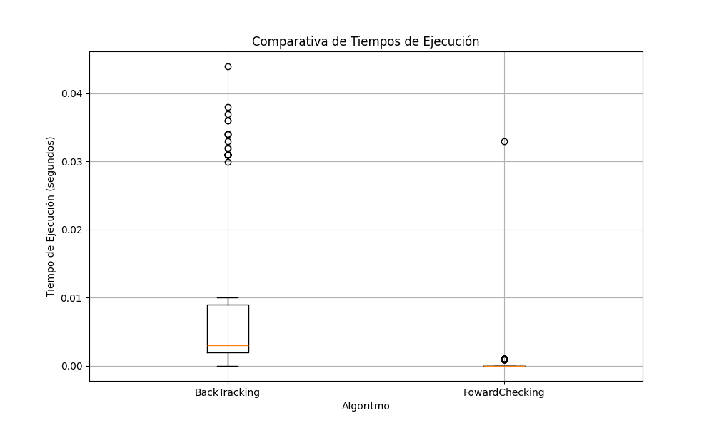
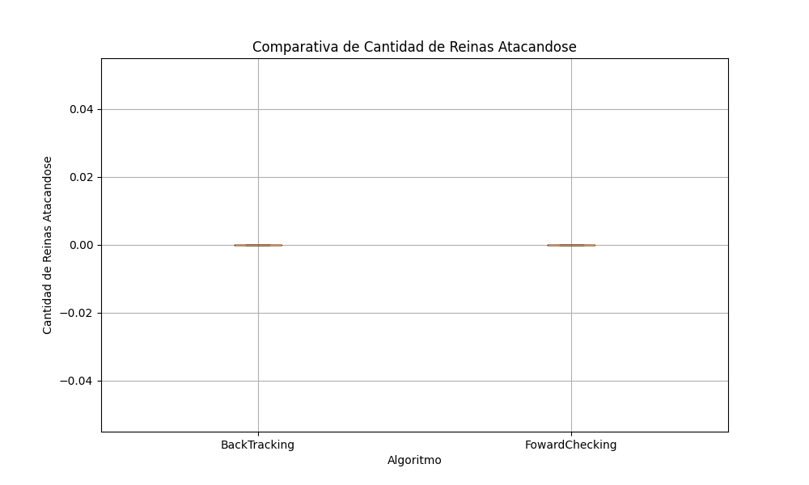
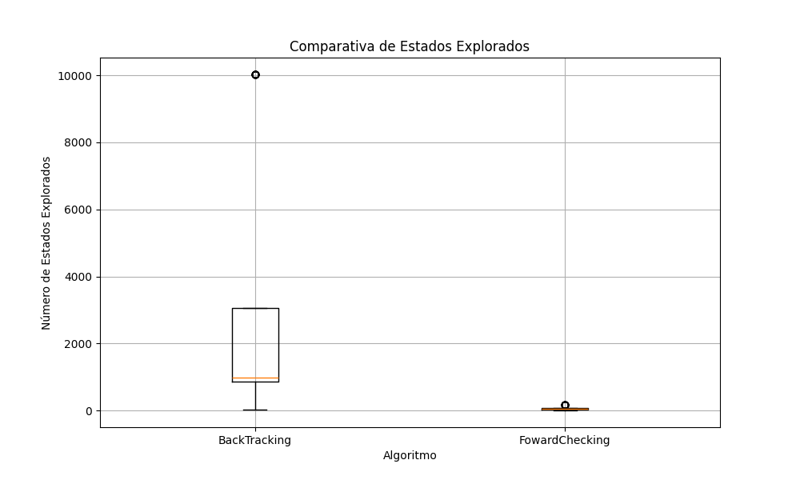
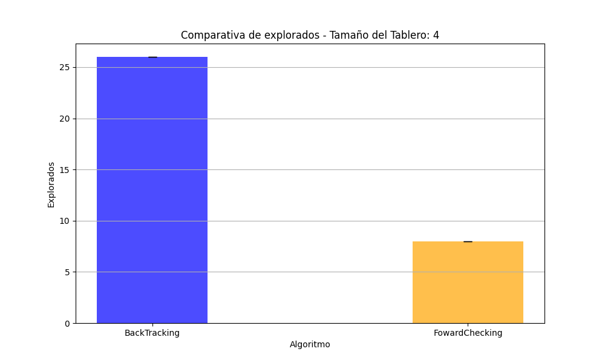
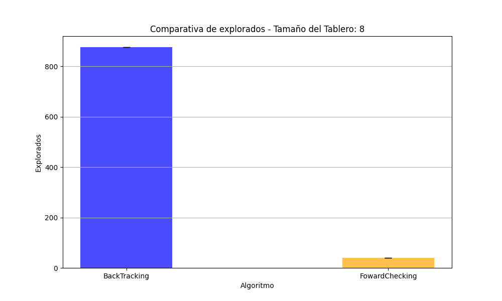
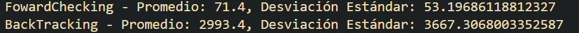

# Trabajo Práctico 6: Satisfacción de restricciones

### 1) Describir en detalle una formulación CSP para el Sudoku.

+ **Variables**: Cada casilla del tablero es una variable. Por ejemplo, la variable en la fila 3 y columna 4 es la variable X[3][4].

+ **Dominio**: El dominio de cada variable es el conjunto de números enteros del 1 a N dependiendo del tamaño del tablero.

+ **Restricciones**:
  + **Restricciones de fila**: Cada fila debe contener todos los números del 1 al N sin repetir.
  + **Restricciones de columna**: Cada columna debe contener todos los números del 1 al N sin repetir.
  + **Restricciones de región**: Cada región debe contener todos los números del 1 al N sin repetir.

### 2) Utilizar el algoritmo AC-3 para demostrar que la arco consistencia puede detectar la inconsistencia de la asignación parcial WA=red, V=blue para el problema de colorear el mapa de Australia

a. Remove SA − WA, delete G from SA.
b. Remove SA − V , delete R from SA, leaving only B.
c. Remove NT − WA, delete G from NT.
d. Remove NT − SA, delete B from NT, leaving only R.
e. Remove NSW − SA, delete B from NSW.
f. Remove NSW − V , delete R from NSW, leaving only G.
g. Remove Q − NT, delete R from Q.
h. Remove Q − SA, delete B from Q.
i. remove Q − NSW, delete G from Q, leaving no domain for Q

### 3) ¿Cúal es la complejidad en el peor caso cuando se ejecuta AC-3 en un arbol estructurado CSP?

En un grafo estructurado en árbol, ningún arco se considerará más de una vez(sin ciclos), por lo que el algoritmo tiene una complejidad temporal de O(E*D), donde E es el número de aristas y D es el tamaño del dominio más grande.

### 4) AC-3 coloca de nuevo en la cola todo arco (Xk, Xi) cuando cualquier valor es removido del dominio de Xi incluso si cada valor de Xk es consistente con los valores restantes de Xi. Supongamos que por cada arco (Xk, Xi) se puede llevar la cuenta del numero de valores restantes de Xi que sean consistentes con cada valor de Xk. Explicar como actualizar ese numero de manera eficiente y demostrar que la arco consistencia puede lograrse en un tiempo total O(n2d2).

Podemos usar una matriz de soporte para llevar la cuenta de los valores restantes de Xi que son consistentes con cada valor de Xk. La matriz de soporte tiene una fila para cada variable Xk y una columna para cada valor en el dominio de Xi. Cada celda (Xk, Xi) en la matriz de soporte contiene el número de valores restantes en el dominio de Xi que son consistentes con el valor de Xk.
La complejidad de actualizar la matriz de soporte es O(n*d) por cada arco, y hay O(n^2) arcos en total. Por lo tanto, la complejidad total es O(n^2*d^2).

### 5) Demostrar la correctitud del algoritmo CSP para arboles estructurados. Para ello, demostrar:
a) Para un CSP cuyo grafo de restricciones es un arbol, la 2-consistencia (consistencia de arco)
implica n−consistencia, siendo n el numero total de variables.

Suponiendo que tenemos un CSP con 2-consistencia, entonces cada arco (Xi, Xj) es consistente.
Si tomamos n-consistencia, donde n es el número total de variables, podemos aplicar a cada arco desde las hojas hasta la raíz del árbol en el camino x1, x2, ..., xn la 2-consistencia para todas las variables en el camino, ya que es nuestra hipótesis. Entonces hemos demostrado que para cualquier arco (Xi, Xj) en el árbol, Xi y Xj son consistentes, por lo que el CSP es n-consistente.

b) Argumentar por qué lo demostrado en 5a es suficiente.

Es suficiente por la propia estructura del árbol, ya que al ser un árbol no hay ciclos y por lo tanto no hay caminos alternativos para llegar a una variable. Por lo tanto, si todos los arcos son consistentes, entonces todas las variables son consistentes.

### 6) Implementar un algoritmo de Backtracking y forward checking para resolver el problema de las n-reinas.

En cuanto a los tiempos de ejecucion el algoritmo de forward checking es mas rapido que el de backtracking.

En cuanto a la cantidad de reinas atacandose ambos llegaron a la solución optima.

Pasaré a mostrar los estados explorados en cada uno de los algoritmos para cada tamaño de tablero. El algoritmo de forward checking explora menos estados que el de backtracking.

Primero una comparativa en general con todos los tamaños de tablero en uno solo.

Ahora una comparativa para cada tamaño de tablero.

Vemos el promedio de estados explorados y su desviación estandar.

### 7) Comparar los resultados obtenidos con el tp anterior

En lo personal mis resultados fueron mucho mejores con los algoritmos de CSP que con los de busqueda local en el tp anterior. En el tp anterior no pude resolver el problema de las n-reinas con tanta completitud y en este tp si pude resolverlo con mas eficacia, considero que los aloritmos de busqueda local pueden tener otras aplicaciones para cuando se necesite una solución aproximada y no exacta (la cual a veces es mas requerida).

Creo que esto se puede deber a que los algoritmos de csp se benefician de tener unas restricciones bien definidas y estructuradas, lo que es el caso de las n-reinas; por otro lado los algoritmos csp para tamaños de tablero muy grandes pueden ser muy costosos.

