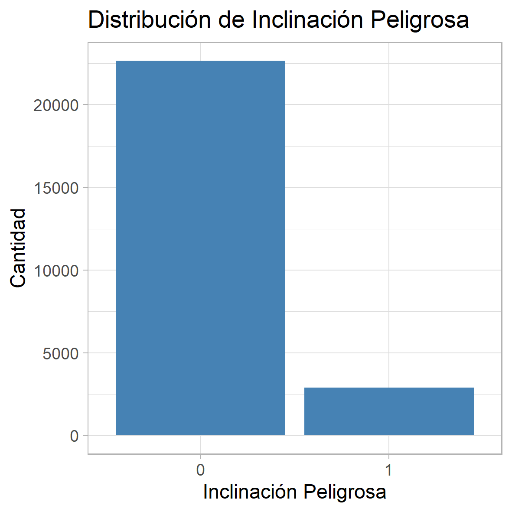
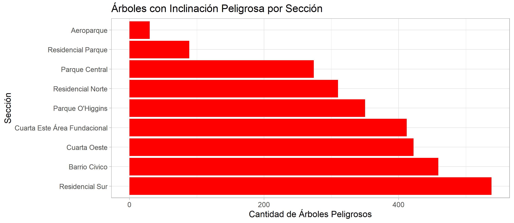
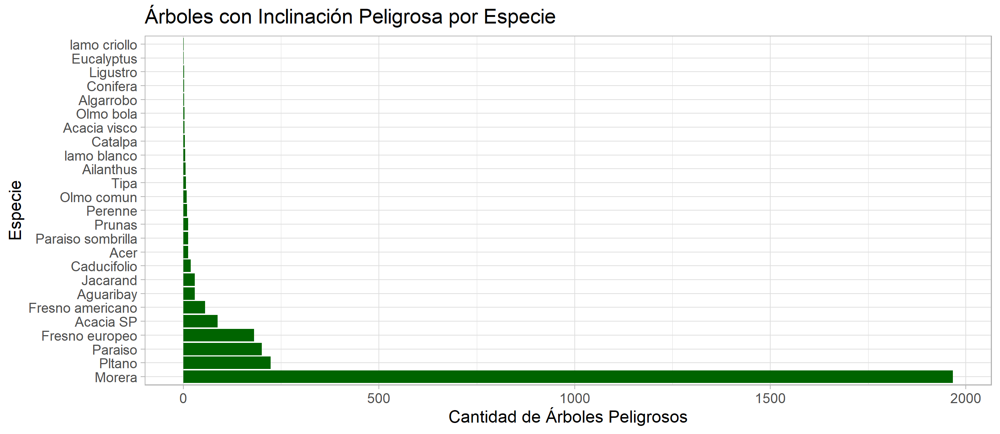
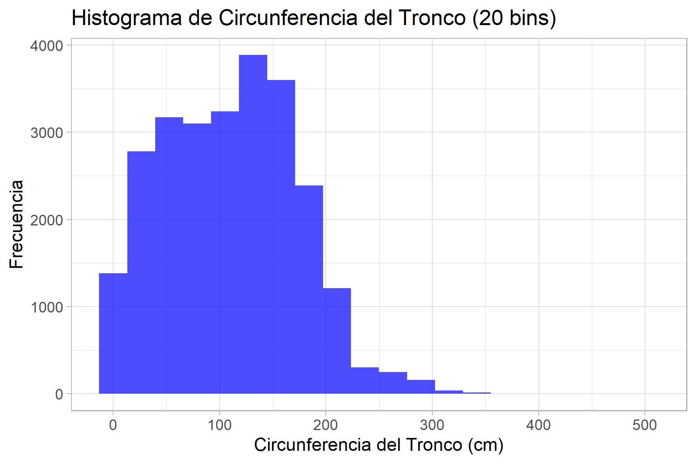
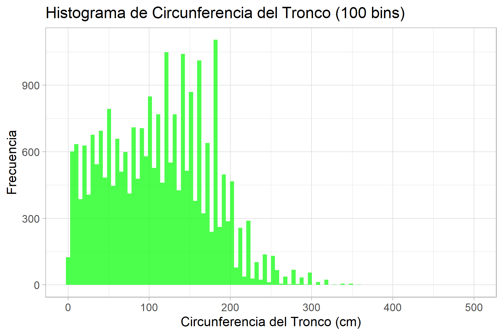
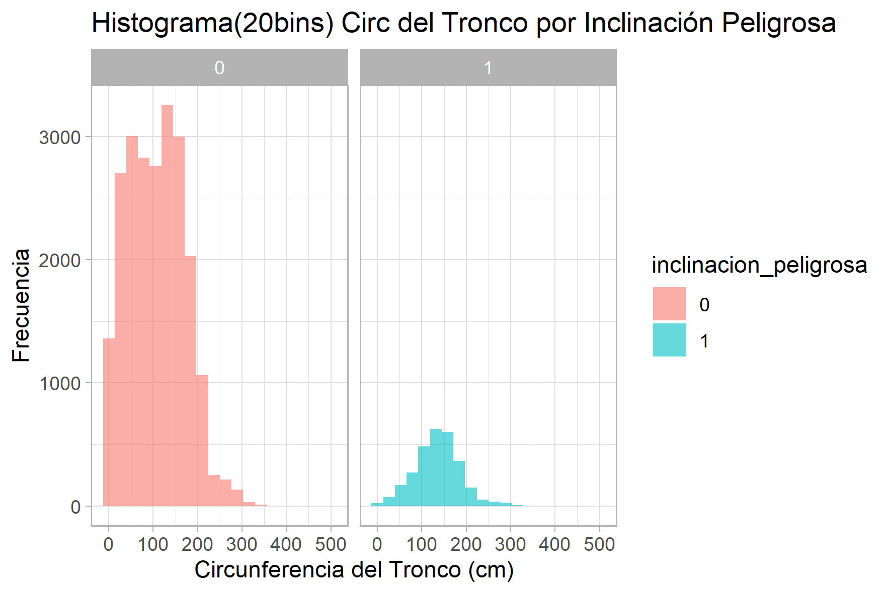

# Ejericio 1
### Seleccionar de manera uniformemente aleatoria el 20% del conjunto de datos y crear un nuevo archivo con el nombre de arbolado-mendoza-dataset-validation.csv y el 80% restante con el nombre de arbolado-mendoza-dataset-train.csv

```
library(dplyr)
library(ggplot2)


data <- read.csv("tp7-ml/data/arbolado-mza-dataset.csv")

data_train <- data %>% sample_frac(0.8)

data_test <- data %>% anti_join(data_train, by = "id")

write.csv(data_train, "tp7-ml/data/arbolado-mendoza-dataset-train.csv", row.names = FALSE)
write.csv(data_test, "tp7-ml/data/arbolado-mendoza-dataset-validation.csv", row.names = FALSE)

```
# Ejericio 2
### a. Cual es la distribución de las clase inclinacion_peligrosa?

```
library(ggplot2)
library(dplyr)

data <- read.csv("tp7-ml/data/arbolado-mendoza-dataset-train.csv")

# Convertir a factor para visualizar mejor (para que se vea solo 0 e 1)
data$inclinacion_peligrosa <- as.factor(data$inclinacion_peligrosa)

# Gráfico de barras 
ggplot(data, aes(x = inclinacion_peligrosa)) +
  geom_bar(fill = "steelblue") +
  labs(title = "Distribución de Inclinación Peligrosa", x = "Inclinación Peligrosa", y = "Cantidad") +
  theme_light()

ggsave("tp7-ml/images/class_dist_peligrosa.png",width = 10, height = 10, units = "cm")

```


Podemos ver que la clase inclinación peligrosa está desbalanceada, ya que la cantidad de árboles con inclinación peligrosa es mucho menor que la cantidad de árboles sin inclinación peligrosa.

### b. ¿Se puede considerar alguna sección más peligrosa que otra?

```
seccion_peligrosa <- data %>%
  group_by(nombre_seccion, inclinacion_peligrosa) %>%
  summarise(count = n()) %>%
  filter(inclinacion_peligrosa == 1)

# barras árboles peligrosos por sección
ggplot(seccion_peligrosa, aes(x = reorder(nombre_seccion, -count), y = count)) +
  geom_bar(stat = "identity", fill = "red") +
  labs(title = "Árboles con Inclinación Peligrosa por Sección", x = "Sección", y = "Cantidad de Árboles Peligrosos") +
  coord_flip() +  # Para voltear el gráfico horizontalmente
  theme_light()

ggsave("tp7-ml/images/peligrosa_per_section.png",width = 23, height = 10, units = "cm")
    
```



La clase que mas arboles peligrosos tiene es la de Residencial sur seguida por el barrio civico.

### c. ¿Se puede considerar alguna especie más peligrosa que otra?

```
especie_peligrosa <- data %>%
  group_by(especie, inclinacion_peligrosa) %>%
  summarise(count = n()) %>%
  filter(inclinacion_peligrosa == 1)

ggplot(especie_peligrosa, aes(x = reorder(especie, -count), y = count)) +
  geom_bar(stat = "identity", fill = "darkgreen") +
  labs(title = "Árboles con Inclinación Peligrosa por Especie", x = "Especie", y = "Cantidad de Árboles Peligrosos") +
  coord_flip() +  # Voltear el gráfico
  theme_light()

ggsave("tp7-ml/images/peligrosa_per_species.png",width = 23, height = 10, units = "cm")

```



La especie que mas arboles peligrosos tiene es Morera seguido por la Pitano.

# Ejericio 3

### b. Generar un histograma de frecuencia para la variable circ_tronco_cm. Probar con diferentes números de bins.

```
ggplot(data, aes(x = circ_tronco_cm)) +
  geom_histogram(bins = 20, fill = "blue", alpha = 0.7) +
  labs(title = "Histograma de Circunferencia del Tronco (20 bins)", x = "Circunferencia del Tronco (cm)", y = "Frecuencia") +
  theme_light()

ggsave("tp7-ml/images/histograma_circunferencia_tronco_20bins.png",width = 15, height = 10, units = "cm")

ggplot(data, aes(x = circ_tronco_cm)) +
  geom_histogram(bins = 100, fill = "green", alpha = 0.7) +
  labs(title = "Histograma de Circunferencia del Tronco (100 bins)", x = "Circunferencia del Tronco (cm)", y = "Frecuencia") +
  theme_light()

ggsave("tp7-ml/images/histograma_circunferencia_tronco_100bins.png",width = 15, height = 10, units = "cm")

```




### Repetir el punto b) pero separando por la clase de la variable inclinación_peligrosa?

```
data$inclinacion_peligrosa <- as.factor(data$inclinacion_peligrosa)

ggplot(data, aes(x = circ_tronco_cm, fill = inclinacion_peligrosa)) +
  geom_histogram(bins = 20, alpha = 0.6, position = "identity") +
  labs(title = "Histograma(20bins) Circ del Tronco por Inclinación Peligrosa", x = "Circunferencia del Tronco (cm)", y = "Frecuencia") +
  facet_wrap(~ inclinacion_peligrosa) +  # Separa los histogramas por la clase de inclinacion_peligrosa
    theme_light()

ggsave("tp7-ml/images/histograma_circunferencia_tronco_inclinacion_peligrosa.png",width = 15, height = 10, units = "cm")

```



### Crear una nueva variable categórica de nombre circ_tronco_cm_cat a partir circ_tronco_cm, en donde puedan asignarse solo 4 posibles valores [ muy alto, alto, medio, bajo]. Utilizar la información del punto b. para seleccionar los puntos de corte para cada categoría. Guardar el nuevo dataframe bajo el nombre de arbolado-mendoza-dataset-circ_tronco_cm-train.csv

```
#puntos de corte 
# Cortes: 0-50 (Bajo), 50-100 (Medio), 100-170 (Alto), >170 (Muy alto)

data$circ_tronco_cm_cat <- cut(data$circ_tronco_cm, 
                               breaks = c(-Inf, 50, 100, 170, Inf), 
                               labels = c("bajo", "medio", "alto", "muy alto"),
                               right = FALSE)  # right = FALSE para incluir el límite inferior en cada rango

# Verificar la distribución de la nueva variable categórica
table(data$circ_tronco_cm_cat)
write.csv(data, "arbolado-mendoza-dataset-circ_tronco_cm-train.csv", row.names = FALSE)

```

